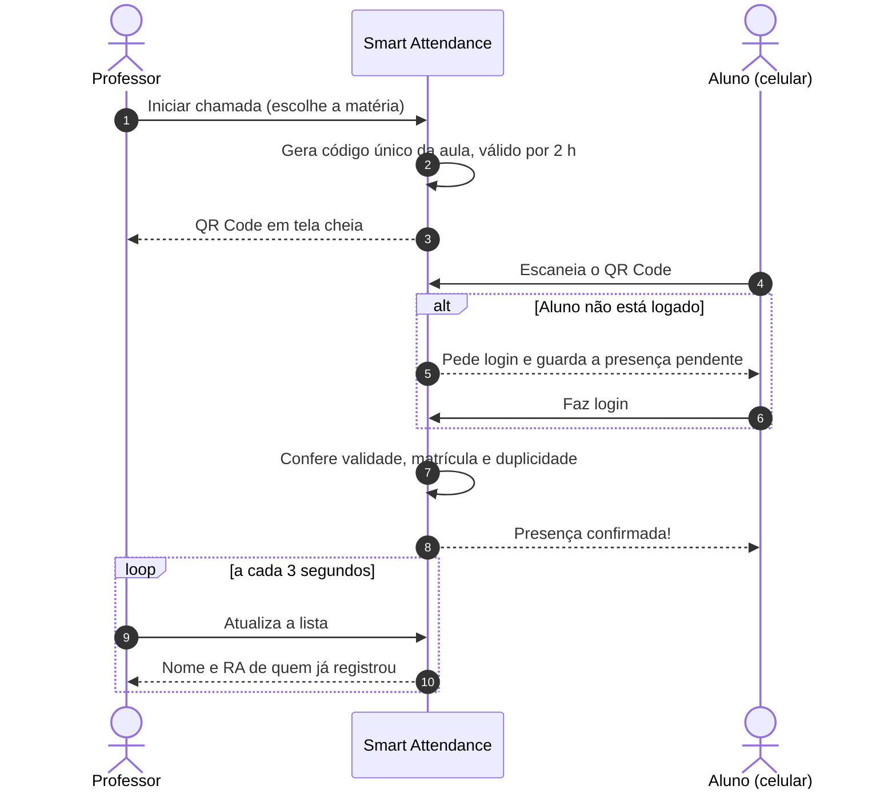

<div align="center">

# Smart Attendance

**Chamada por QR Code para instituições de ensino.**
O professor projeta um QR Code, o aluno aponta a câmera do celular e a presença é registrada em segundos, com frequência, faltas e notas sempre atualizadas.

[](https://github.com/AtilaAlvesRodrigues/smart-attendance/actions/workflows/laravel.yml)
[](https://smart-attendance-nine-alpha.vercel.app)


**[Acessar a demonstração](https://smart-attendance-nine-alpha.vercel.app)** ·
[Manual do usuário](docs/manual-do-usuario.md) ·
[Instalação](docs/instalacao.md) ·
[Documentação completa](docs/README.md)


</div>

---

## Sumário

- [O problema e a solução](#o-problema-e-a-solução)
- [Experimente](#experimente)
- [Funcionalidades](#funcionalidades)
- [Como funciona a chamada](#como-funciona-a-chamada)
- [Regras acadêmicas](#regras-acadêmicas)
- [Segurança](#segurança)
- [Tecnologias](#tecnologias)
- [Rodando localmente](#rodando-localmente)
- [Testes e integração contínua](#testes-e-integração-contínua)
- [Estrutura do projeto](#estrutura-do-projeto)
- [Documentação](#documentação)
- [Próximos passos](#próximos-passos)
- [Equipe](#equipe)

---

## O problema e a solução

A chamada em papel toma de 5 a 10 minutos de cada aula, depende de o professor transcrever a lista depois e aceita a assinatura de um colega no lugar de quem faltou.

O Smart Attendance substitui a lista por um **QR Code único por aula**:

| | Chamada em papel | Smart Attendance |
|---|---|---|
| Tempo por aula | 5 a 10 minutos | Segundos: todos escaneiam ao mesmo tempo |
| Lançamento | Manual, depois da aula | Automático, com a lista ao vivo na tela do professor |
| Frequência do aluno | Só no fim do semestre | Sempre visível, com alerta antes de reprovar |
| Dados pessoais | Em papel, sem controle | CPF, RA e e-mail criptografados no banco |

---

## Experimente

A demonstração está publicada em **https://smart-attendance-nine-alpha.vercel.app**, com dados de teste:

| Perfil | Onde entrar | Usuário | Senha |
|---|---|---|---|
| Aluno | Entrar como Aluno | `aluno.teste@site.com` (ou RA `100000000`) | `senha123` |
| Professor | Entrar como Professor | `professor@teste.com` | `senha123` |
| Master (administração) | Entrar como Professor | `master@admin.com` | `senha123` |

> [!NOTE]
> Os dados da demonstração são fictícios e podem ser reiniciados a qualquer momento. Não cadastre dados reais. Na demo, o envio de e-mail está desligado: ao cadastrar alguém, o Master recebe na tela o token de primeiro acesso.

Para ver a chamada funcionando: entre como professor no computador, clique em **Iniciar chamada**, escolha uma matéria e escaneie o QR Code com o celular logado como aluno.

---

## Funcionalidades

### Aluno


- **Registra presença** apontando a câmera para o QR Code da aula. Se ainda não estiver logado, o sistema guarda a presença pendente e conclui depois do login.
- **Painel por matéria** com a situação em texto e cor (*Em dia*, *Atenção*, *Reprovado*), frequência, faltas usadas em relação ao limite, média e as notas (P1, T1, T2, P2).
- **Explicação da situação** em linguagem simples, por exemplo "Restam só 1 falta até o limite".
- **Histórico de aulas**: a data de cada chamada e se esteve presente ou faltou.
- **Primeiro acesso** com token provisório e criação da senha definitiva.
- **Esqueci minha senha** e **solicitação de acesso** pela página pública.

<br clear="right">

### Professor

- **Chamada por QR Code** válida por 2 horas, com a lista de presentes atualizada a cada 3 segundos.
- **Modo projeção**: QR Code em tela cheia, com o nome da matéria, o número de presentes e a validade.
- **Link da chamada** para copiar e enviar a quem estiver sem câmera.
- **Turmas e notas**: lança as quatro notas direto na tabela (salva sozinha) e vê a frequência e a situação de cada aluno.
- **Relatórios** de presença com filtro por matéria e período, prontos para imprimir.
- **Palestras e eventos**: lista de presença para público externo, sem login, com proteção contra robôs e exportação em PDF.

### Master (administração)

- **Cadastro** de alunos, professores e matérias.
- **Gerenciar turma**: define os professores e os alunos matriculados de cada matéria.
- **Pedidos de acesso**: aprova ou rejeita quem pediu cadastro pela página pública; a visão geral avisa quando há pedidos pendentes.
- **Central de presenças** com todos os registros e filtros por professor, matéria e aluno.
- **Listagens** de professores, alunos e matérias com busca.

<table>
  <tr>
    <td width="50%"><br><sub>Chamada aberta, com a lista de presentes ao vivo</sub></td>
    <td width="50%"><br><sub>Notas, frequência e situação de cada aluno</sub></td>
  </tr>
  <tr>
    <td width="50%"><br><sub>Master define professores e alunos da turma</sub></td>
    <td width="50%"><br><sub>Visão geral da administração</sub></td>
  </tr>
</table>

O passo a passo de cada tela está no **[Manual do usuário](docs/manual-do-usuario.md)**.

---

## Como funciona a chamada



Os detalhes de cada fluxo (primeiro acesso, pedido de acesso, eventos, notas) estão em [Arquitetura e fluxos](docs/arquitetura.md).

---

## Regras acadêmicas

Uma única classe, [`App\Support\SituacaoAcademica`](app/Support/SituacaoAcademica.php), calcula a situação do aluno. Assim, o painel do aluno, a tela de notas do professor e a central do Master mostram sempre os mesmos números.

| Regra | Como é calculada |
|---|---|
| Faltas | Aulas já realizadas na matéria − presenças do aluno |
| Limite de faltas | 25% das aulas previstas no semestre (frequência mínima de 75%) |
| Reprovado por falta | Quando as faltas **passam** do limite |
| Média | Média simples das notas lançadas (P1, T1, T2, P2) |
| Aprovado | As quatro notas lançadas, média ≥ 5,0 e dentro do limite de faltas |
| Atenção | Faltas perto do limite, média parcial abaixo de 5,0 ou frequência abaixo de 75% |

Mais exemplos em [Regras acadêmicas](docs/regras-academicas.md).

---

## Segurança

| Camada | Implementação |
|---|---|
| Dados pessoais | CPF, RA e e-mail criptografados com AES-256 (cast `encrypted`) |
| Busca em dados criptografados | *Blind index*: hash SHA-256 com a chave da aplicação, nas colunas `*_search` |
| Perfis isolados | Três *guards* de autenticação independentes (aluno, professor, master) e middleware de papel |
| Força bruta | Limite de tentativas no login, na recuperação de senha, no check-in de eventos e nas buscas |
| CSRF | Token em todos os formulários e requisições AJAX |
| XSS | Saída escapada no Blade; dados do usuário inseridos no JavaScript com `textContent` |
| SQL injection | Consultas com *bindings*; colunas de nota validadas por lista permitida |
| Cabeçalhos HTTP | `X-Frame-Options`, `X-Content-Type-Options`, `Referrer-Policy`, `Permissions-Policy` |
| Robôs | *Honeypot* no check-in público de eventos |
| Sessão | Expira em 1 hora, com aviso na tela e sincronização entre abas |
| QR Code | Único por aula, com validade de 2 horas, nunca exibido em página pública |

Cada camada tem teste automatizado. Detalhes, arquivos envolvidos e limitações conhecidas: [Segurança](docs/seguranca.md).

---

## Tecnologias

| Área | Tecnologia |
|---|---|
| Backend | PHP 8.2+ e Laravel 12 |
| Banco de dados | PostgreSQL 17 (produção no Supabase; SQLite em memória nos testes) |
| Frontend | Blade, Tailwind CSS 4, Vite 7 e JavaScript sem framework |
| QR Code e PDF | qrcodejs e jsPDF |
| Testes | PHPUnit 11 |
| CI | GitHub Actions |
| Hospedagem | Vercel (runtime `vercel-php`) e Supabase |

---

## Rodando localmente

Pré-requisitos: PHP 8.2+ com `pdo_pgsql`, Composer, Node.js 22 e PostgreSQL.

```bash
git clone https://github.com/AtilaAlvesRodrigues/smart-attendance.git
cd smart-attendance
composer install
npm install && npm run build
cp .env.example .env
php artisan key:generate
```

Crie o banco `smart_attendance`, ajuste `DB_USERNAME` e `DB_PASSWORD` no `.env` e rode:

```bash
php artisan migrate --seed
php artisan serve
```

Acesse `http://localhost:8000` e use os logins da tabela acima. Para testar com o celular na mesma rede ou pela internet, veja o [guia de instalação](docs/instalacao.md).

---

## Testes e integração contínua

```bash
composer test                               # suíte completa
php artisan test --filter=SituacaoAcademica  # um arquivo específico
```

São **204 testes** (558 verificações) cobrindo login dos três perfis, chamada e QR Code, regras de frequência e notas, cadastros, turmas, eventos e cada camada de segurança.

O [pipeline do GitHub Actions](.github/workflows/laravel.yml) roda em todo push e Pull Request para a `main`, contra um PostgreSQL 17 real, em 6 módulos: configuração, banco de dados, segurança, classes, suíte completa e relatório em PDF. Veja [Testes e CI](docs/testes-e-ci.md).

---

## Estrutura do projeto

```
smart-attendance/
├── app/
│   ├── Http/
│   │   ├── Controllers/      # Um controller por área: login, painéis, presença, turma, eventos...
│   │   ├── Middleware/       # CheckRole, PrimeiroAcesso, SecurityHeaders
│   │   └── View/Composers/   # Dados do menu lateral
│   ├── Models/               # AlunoModel, ProfessorModel, UsuarioMaster, Materia, Presenca, SolicitacaoAcesso
│   ├── Support/              # SituacaoAcademica (regra de frequência e notas)
│   ├── Traits/               # HasBlindIndex (busca em campos criptografados)
│   ├── Mail/                 # E-mail de primeiro acesso
│   └── Console/Commands/     # secure:data (criptografa dados legados)
├── database/
│   ├── migrations/           # Estrutura do banco
│   ├── seeders/              # Dados de demonstração
│   └── factories/            # Dados para testes
├── resources/views/          # Telas Blade, separadas por perfil (aluno, professor, master)
├── public/
│   ├── css/                  # Temas por perfil + usability.css (acessibilidade)
│   └── js/                   # Tema, modais e páginas de eventos
├── routes/web.php            # 58 rotas
├── tests/                    # Feature (fluxos e segurança) e Unit (regras)
├── api/index.php             # Entrada serverless na Vercel
├── docs/                     # Documentação e capturas de tela
└── vercel.json               # Build, rotas e tarefa diária da Vercel
```

---

## Documentação

| Documento | Conteúdo |
|---|---|
| [Manual do usuário](docs/manual-do-usuario.md) | Passo a passo de cada tela, por perfil |
| [Arquitetura e fluxos](docs/arquitetura.md) | Camadas, autenticação, rotas e diagramas dos fluxos |
| [Banco de dados](docs/banco-de-dados.md) | Tabelas, colunas, relacionamentos e diagrama |
| [Regras acadêmicas](docs/regras-academicas.md) | Frequência, faltas, notas e situação, com exemplos |
| [Segurança](docs/seguranca.md) | Cada camada de proteção, onde está no código e como é testada |
| [Instalação](docs/instalacao.md) | Ambiente local, variáveis, teste pelo celular e e-mail |
| [Deploy](docs/deploy.md) | Publicação na Vercel com PostgreSQL no Supabase |
| [Testes e CI](docs/testes-e-ci.md) | Suítes de teste e módulos do pipeline |
| [Design e acessibilidade](docs/design-e-acessibilidade.md) | Identidade visual, padrões de interface e acessibilidade |
| [Como contribuir](CONTRIBUTING.md) | Fluxo de branches, commits e Pull Requests |
| [Histórico de mudanças](CHANGELOG.md) | O que mudou em cada versão |

---

## Próximos passos

- Justificativa de faltas, com análise pelo professor
- QR Code que muda a cada 30 segundos, para impedir o envio por foto
- Correção de presença pelo professor
- Edição e exclusão de cadastros pelo Master
- Exportação de relatórios em planilha
- Envio de e-mails pelo servidor da instituição

---

## Equipe

Projeto Integrador criado por **Átila Alves Rodrigues**, com contribuições de **Matheus Evangelista** e **João Vitor Leonardi**.
Veja todos os contribuidores em [Contributors](https://github.com/AtilaAlvesRodrigues/smart-attendance/graphs/contributors).
