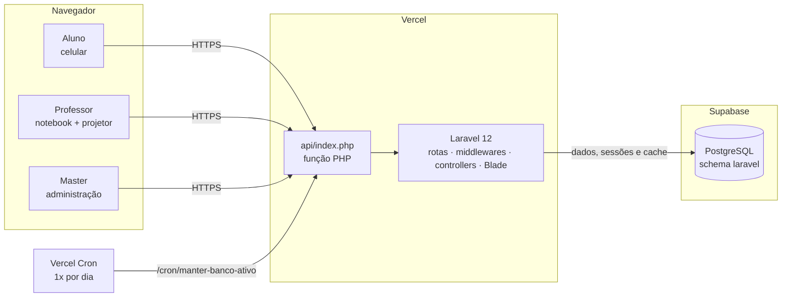
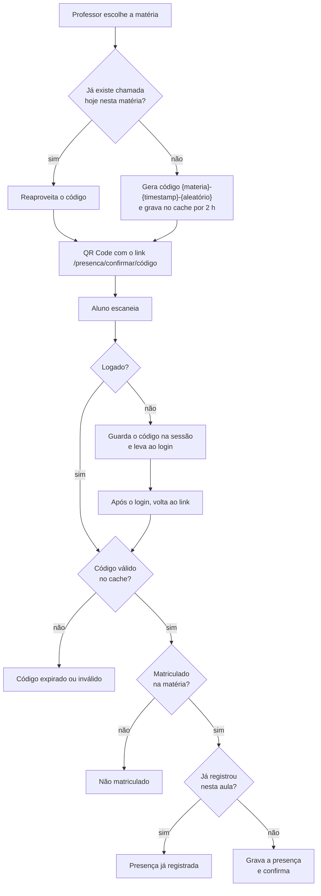
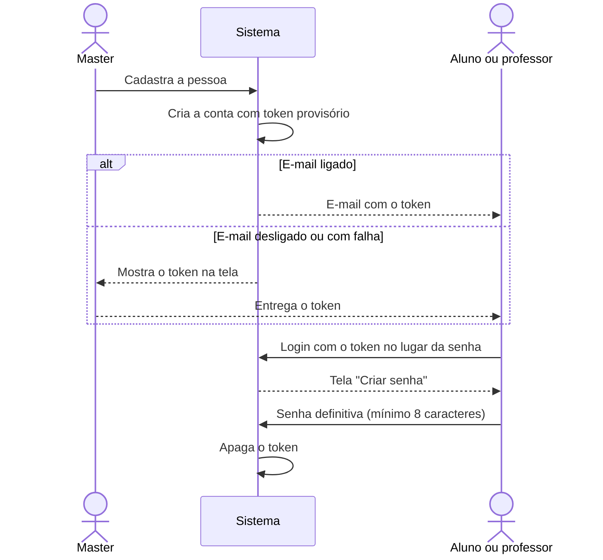

# Arquitetura e fluxos

Aplicação Laravel 12 monolítica, renderizada no servidor com Blade, com pequenos trechos de JavaScript para as partes ao vivo (lista de presentes, notas, buscas). Não há API separada nem framework de frontend.

- [Visão geral](#visão-geral)
- [Autenticação por perfil](#autenticação-por-perfil)
- [Camadas do código](#camadas-do-código)
- [Rotas](#rotas)
- [Fluxos](#fluxos)
- [Frontend](#frontend)
- [Cache e sessões](#cache-e-sessões)

---

## Visão geral

- **Arquivos estáticos** (`public/css`, `public/js`, `public/build`) são servidos direto pela Vercel; o resto passa pela função PHP.
- **Sessões e cache** ficam no próprio PostgreSQL (drivers `database`), porque cada requisição pode cair numa instância diferente da função.
- Detalhes da hospedagem em [Deploy](deploy.md).

---

## Autenticação por perfil

Cada perfil tem seu próprio *guard*, com model, tabela e sessão independentes. Um aluno logado não é reconhecido nas rotas de professor, e vice-versa.

| Guard | Model | Tabela | Login | Painel |
|---|---|---|---|---|
| `alunos` | `AlunoModel` | `alunos` | `/login/aluno` (RA, e-mail ou CPF) | `/dashboard/aluno` |
| `professores` | `ProfessorModel` | `professores` | `/login/professor` (e-mail ou CPF) | `/professor/dashboard` |
| `masters` | `UsuarioMaster` | `usuario_masters` | `/login/professor` (e-mail) | `/dashboard/master` |

O login do professor também aceita o Master: [`ProfessorLoginController`](../app/Http/Controllers/ProfessorLoginController.php) procura primeiro um professor e, se não achar, um administrador.

Proteções em camadas nas rotas:

1. `auth:<guard>` exige o login do perfil certo.
2. `role:<papel>` ([`CheckRole`](../app/Http/Middleware/CheckRole.php)) confere o papel gravado no usuário.
3. `primeiro-acesso` ([`PrimeiroAcessoMiddleware`](../app/Http/Middleware/PrimeiroAcessoMiddleware.php)) só libera a criação de senha para quem entrou com token provisório.

---

## Camadas do código

### Controllers

| Controller | Responsabilidade |
|---|---|
| `LoginRouterController` | Página inicial e escolha de perfil; mostra a aula em andamento sem expor o QR |
| `AlunoLoginController` / `ProfessorLoginController` | Login por perfil, detecção de primeiro acesso e presença pendente |
| `CriarSenhaController` | Troca do token provisório pela senha definitiva |
| `EsqueciSenhaController` | Novo token por e-mail, com resposta que não revela se a conta existe |
| `SolicitacaoAcessoController` | Pedido público de cadastro e aprovação/rejeição pelo Master |
| `DashboardController` | Painéis dos três perfis e listagens do Master |
| `PresencaController` | Geração do QR, confirmação da presença e lista de presentes |
| `GerenciarMateriaController` | Turmas do professor, notas e relatórios |
| `EventoController` | Check-in público de palestras e eventos |
| `MasterCadastroController` | Cadastro de alunos, professores e matérias |
| `MasterTurmaController` | Professores e alunos de cada matéria |
| `MasterSearchController` | Buscas com filtro das listagens do Master (JSON) |

### Models

| Model | Tabela | Destaques |
|---|---|---|
| `AlunoModel` | `alunos` | `email`, `cpf`, `ra` criptografados; *soft delete*; notas no pivot `aluno_materia` |
| `ProfessorModel` | `professores` | `email`, `cpf` criptografados; *soft delete* |
| `UsuarioMaster` | `usuario_masters` | `nome` e `email` criptografados |
| `Materia` | `materias` | `total_aulas` define o limite de faltas |
| `Presenca` | `presencas` | Uma linha por aluno por chamada (`codigo_aula`) |
| `SolicitacaoAcesso` | `solicitacoes_acesso` | Pedido público com status `pendente`, `aprovado` ou `rejeitado` |

Todos os models com dados pessoais usam o trait [`HasBlindIndex`](../app/Traits/HasBlindIndex.php), que preenche as colunas `*_search` ao salvar. Veja [Segurança](seguranca.md#dados-pessoais-criptografados).

### Regra de negócio

[`App\Support\SituacaoAcademica`](../app/Support/SituacaoAcademica.php) concentra o cálculo de frequência, faltas, média e situação. É usada no painel do aluno, na tela de notas do professor e na central de presenças do Master, e o JavaScript da tela de notas espelha a mesma regra. Veja [Regras acadêmicas](regras-academicas.md).

### Outros

| Arquivo | Função |
|---|---|
| [`SecurityHeaders`](../app/Http/Middleware/SecurityHeaders.php) | Cabeçalhos HTTP de segurança em todas as respostas |
| [`SidebarComposer`](../app/Http/View/Composers/SidebarComposer.php) | Contadores do menu lateral |
| [`PrimeiroAcessoMail`](../app/Mail/PrimeiroAcessoMail.php) | E-mail com o token provisório |
| [`secure:data`](../app/Console/Commands/SecureExistingData.php) | Criptografa dados antigos e gera os *blind indexes* |

---

## Rotas

São 58 rotas em [`routes/web.php`](../routes/web.php). As principais:

### Públicas

| Método | Caminho | O que faz |
|---|---|---|
| GET | `/login` | Página inicial |
| GET/POST | `/login/aluno`, `/login/professor` | Login (10 tentativas a cada 3 min por usuário) |
| GET/POST | `/esqueci-senha/{aluno\|professor}` | Recuperação de senha (3 a cada 10 min por e-mail) |
| GET/POST | `/solicitar-acesso/{aluno\|professor}` | Pedido de cadastro (5 a cada 10 min por e-mail) |
| GET/POST | `/criar-senha` | Senha definitiva no primeiro acesso |
| GET | `/presenca/confirmar/{codigo}` | Link do QR Code; pede login se necessário |
| GET/POST | `/evento/checkin` | Check-in de palestra, sem login (5 por minuto por participante) |
| GET | `/aluno/demonstracao`, `/professor/demonstracao` | Demonstrações dos painéis |
| GET | `/cron/manter-banco-ativo` | Tarefa diária da Vercel (exige `CRON_SECRET`) |

### Professor (`auth:professores`, `role:professor`)

| Método | Caminho | O que faz |
|---|---|---|
| GET | `/professor/dashboard` | Painel |
| GET | `/professor/presenca` | Escolha da matéria |
| GET | `/professor/presenca/gerar/{materia}` | Abre a chamada e mostra o QR |
| GET | `/professor/presenca/check/{codigo}` | Lista de presentes (JSON: nome e RA) |
| GET | `/professor/gerenciar`, `/professor/gerenciar/{materia}` | Turmas e notas |
| POST | `/professor/gerenciar/{materia}/notas` | Salva uma nota |
| GET | `/professor/gerenciar/relatorios` | Relatório de presenças |
| GET/POST | `/professor/evento/*` | Painel, lista e encerramento de evento |

### Master (`auth:masters`, `role:master`, prefixo `/dashboard/master`)

| Método | Caminho | O que faz |
|---|---|---|
| GET | `/` | Visão geral |
| GET | `/professores`, `/alunos`, `/materias`, `/presenca` | Listagens |
| GET/POST | `/cadastrar`, `/cadastrar/{aluno\|professor\|materia}` | Cadastros (JSON) |
| GET/PUT | `/materias/{materia}/turma` | Gerenciar turma |
| GET/POST | `/solicitacoes`, `/solicitacoes/{id}/aprovar\|rejeitar` | Pedidos de acesso |
| GET | `/search/*` | Buscas das listagens (30 por minuto) |

---

## Fluxos

### Chamada por QR Code

A chave do cache é `aula_materia_{materia}_{data}`, calculada no fuso da aplicação (`America/Sao_Paulo`), para a chamada funcionar também à noite.

### Primeiro acesso

### Pedido de acesso

1. A pessoa preenche `/solicitar-acesso/{tipo}`. Enquanto digita o e-mail, o sistema avisa se já existe conta ou pedido pendente.
2. O pedido fica `pendente`, com os dados pessoais criptografados.
3. O Master aprova ou rejeita em **Solicitações**. Na aprovação, o sistema confere de novo se o e-mail ou o CPF já existem, cria a conta e envia o token de primeiro acesso.

### Palestras e eventos

1. O professor abre **Evento / Palestra**: o sistema gera um token de 16 caracteres, guardado no cache por 8 horas.
2. O QR Code leva a `/evento/checkin?token=...`, onde o participante informa nome e e-mail, sem login. Um campo oculto (*honeypot*) descarta envios de robôs.
3. Os check-ins ficam no cache; o painel do professor atualiza a lista a cada 30 segundos e gera o PDF com jsPDF.
4. **Encerrar Palestra** apaga a sessão do evento.

---

## Frontend

- **Layout único** em [`resources/views/layouts/theme.blade.php`](../resources/views/layouts/theme.blade.php): menu superior, menu lateral (professor e Master), rodapé, botão de tema e cronômetro da sessão.
- **Views por perfil** em `resources/views/aluno`, `professor` e `master`; páginas públicas em `pages`.
- **CSS em camadas**, nesta ordem:
  1. `resources/css/app.css`: Tailwind 4, compilado pelo Vite.
  2. `public/css/theme.css`: identidade visual e tema claro/escuro.
  3. `public/css/theme_{aluno,professor,master}.css`: componentes de cada perfil.
  4. `public/css/usability.css`: contraste, tamanhos mínimos, foco, celular e redução de movimento. Sempre por último.
- **JavaScript** sem framework: QR Code com qrcodejs, PDF com jsPDF e `fetch` para as partes ao vivo.

Padrões visuais e de acessibilidade em [Design e acessibilidade](design-e-acessibilidade.md).

---

## Cache e sessões

| Dado | Onde | Duração |
|---|---|---|
| Código da chamada | Cache, chave `aula_materia_{id}_{data}` | 2 horas |
| Token e check-ins de evento | Cache | 8 horas |
| Sessão do usuário | Tabela `sessions` | Expira em 1 hora pelo cronômetro da sessão |
| Presença pendente (antes do login) | Sessão, `pending_attendance_code` | Até o login |
