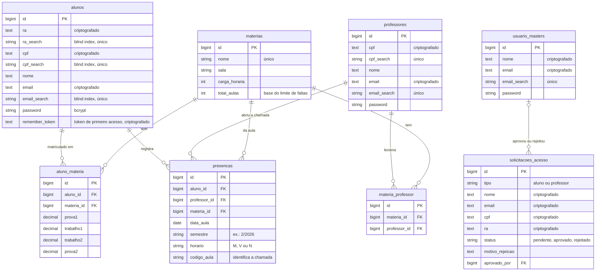

# Banco de dados

PostgreSQL 17. Em produção as tabelas ficam no schema `laravel` do Supabase, separado do schema `public`, que é exposto pela API REST automática do Supabase. Nos testes automatizados, é usado SQLite em memória.

A estrutura é criada pelas migrations em [`database/migrations`](../database/migrations).

## Diagrama



## Tabelas do sistema

| Tabela | Conteúdo | Observações |
|---|---|---|
| `alunos` | Alunos | `ra`, `cpf` e `email` criptografados, cada um com blind index único; *soft delete* |
| `professores` | Professores | `cpf` e `email` criptografados, com blind index único; *soft delete* |
| `usuario_masters` | Administradores | `nome` e `email` criptografados; *soft delete* |
| `materias` | Disciplinas | `nome` único; `total_aulas` define o limite de faltas; *soft delete* |
| `aluno_materia` | Matrículas e notas | Uma linha por aluno por matéria, com P1, T1, T2 e P2 (0 a 10, podem ficar vazias) |
| `materia_professor` | Quem leciona o quê | Uma matéria pode ter mais de um professor |
| `presencas` | Presenças | Uma linha por aluno por chamada; `codigo_aula` agrupa a chamada |
| `solicitacoes_acesso` | Pedidos públicos de cadastro | E-mail sem índice único, para permitir um novo pedido depois de uma rejeição |

## Tabelas de infraestrutura do Laravel

| Tabela | Uso |
|---|---|
| `sessions` | Sessões dos usuários (driver `database`) |
| `cache`, `cache_locks` | Códigos das chamadas (2 h) e sessões de eventos (8 h) |
| `jobs`, `job_batches`, `failed_jobs` | Fila (hoje o envio de e-mail é síncrono) |
| `users`, `password_reset_tokens` | Padrão do Laravel; não usadas pelos perfis do sistema |

## Integridade

- **Exclusão em cascata**: apagar de fato um aluno, professor ou matéria remove as matrículas, os vínculos e as presenças ligadas a ele. Como os três usam *soft delete*, o uso normal só marca o registro como excluído e preserva o histórico.
- **Unicidade de dados criptografados**: como o texto cifrado muda a cada gravação, a unicidade de e-mail, CPF e RA é garantida pelos índices únicos nas colunas `*_search`.
- **Quem aprovou um pedido**: se o administrador for removido, `solicitacoes_acesso.aprovado_por` fica vazio, sem apagar o pedido.

## Dados de demonstração

O [`DatabaseSeeder`](../database/seeders/DatabaseSeeder.php) cria:

- 1 administrador, 6 professores e 21 alunos, todos com a senha `senha123`;
- 7 matérias, com professores e alunos vinculados;
- presenças em dias úteis das últimas semanas;
- para o aluno `aluno.teste@site.com`, notas lançadas e uma matéria em situação de atenção, para demonstrar os alertas.

Rodar o seed de novo não duplica dados: ele para se o administrador de teste já existir.

```bash
php artisan migrate:fresh --seed   # recria tudo do zero
```

> [!WARNING]
> Os *blind indexes* usam a `APP_KEY` como chave. Se a `APP_KEY` mudar, os dados já gravados deixam de ser encontrados. Recrie o banco ou rode `php artisan secure:data` com a chave nova.
