# Manual do usuário

Como usar o Smart Attendance em cada perfil. As telas funcionam no computador e no celular, nos temas escuro e claro (botão redondo no canto inferior direito).

- [Página inicial e login](#página-inicial-e-login)
- [Aluno](#aluno)
- [Professor](#professor)
- [Master (administração)](#master-administração)
- [Dúvidas frequentes](#dúvidas-frequentes)

---

## Página inicial e login

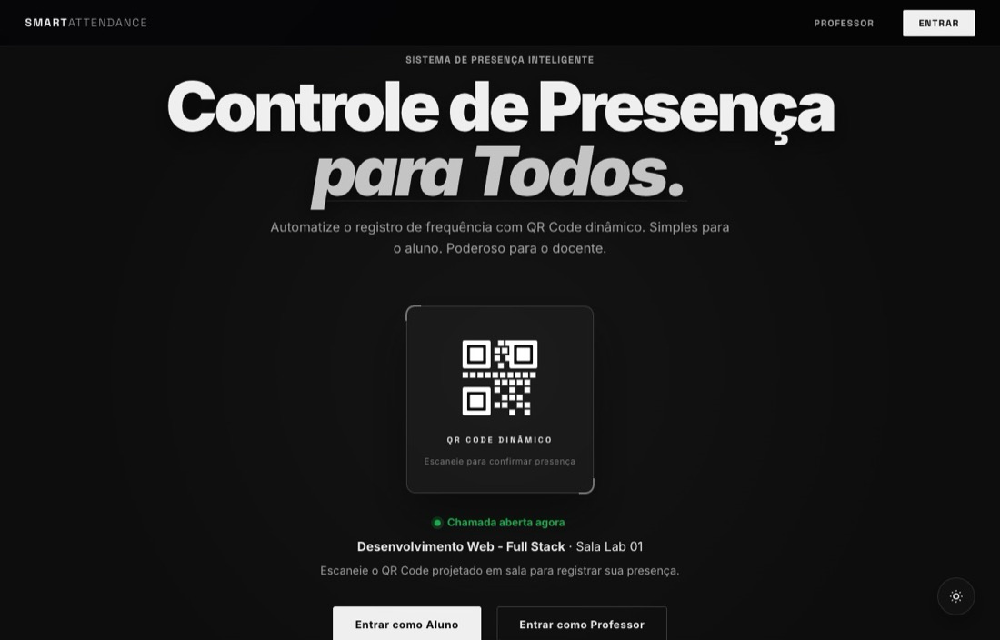

A página inicial explica o sistema e leva ao login de cada perfil. Quando há uma chamada aberta, ela mostra o nome da matéria e a sala, mas **nunca o QR Code**: ele só aparece na sala, na tela do professor.

| Perfil | Botão | Como entrar |
|---|---|---|
| Aluno | **Entrar como Aluno** | RA, e-mail ou CPF, e a senha |
| Professor | **Entrar como Professor** | E-mail ou CPF, e a senha |
| Master | **Entrar como Professor** | E-mail e senha do administrador |

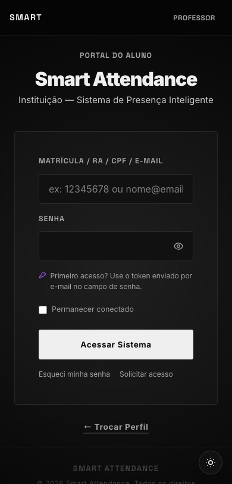

Por segurança, a sessão expira **1 hora** depois do login. O tempo restante aparece numa pílula no topo do painel e, ao expirar, o sistema avisa e volta para a página inicial.

### Primeiro acesso

Quem é cadastrado pelo Master recebe um **token provisório**: por e-mail ou, quando o envio está desligado, entregue pelo próprio administrador.

1. Na tela de login do seu perfil, digite seu usuário e use o **token como senha**.
2. O sistema abre a tela **Criar senha**. Escolha uma senha com pelo menos 8 caracteres e confirme.
3. Pronto: dali em diante, entre com a senha nova.

### Esqueci minha senha

Na tela de login, clique em **Esqueci minha senha** e informe seu e-mail. Se ele estiver cadastrado, chega um novo token provisório. A resposta na tela é sempre a mesma, para não revelar quem tem conta no sistema.

### Solicitar acesso

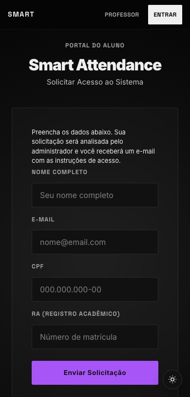

Quem ainda não tem conta clica em **Solicitar acesso** na tela de login e preenche nome, e-mail, CPF e, no caso do aluno, o RA. O pedido vai para o Master, que aprova ou rejeita. Na aprovação, a conta é criada e o token de primeiro acesso é enviado por e-mail.

---

## Aluno

### Registrar presença

1. Na sala, abra a **câmera do celular** e aponte para o QR Code que o professor projetar.
2. Toque no link que aparecer. Se não estiver logado, entre com seu RA, e-mail ou CPF: a presença é concluída logo depois do login.
3. Aparece **Presença confirmada!**, e seu nome surge na lista do professor.

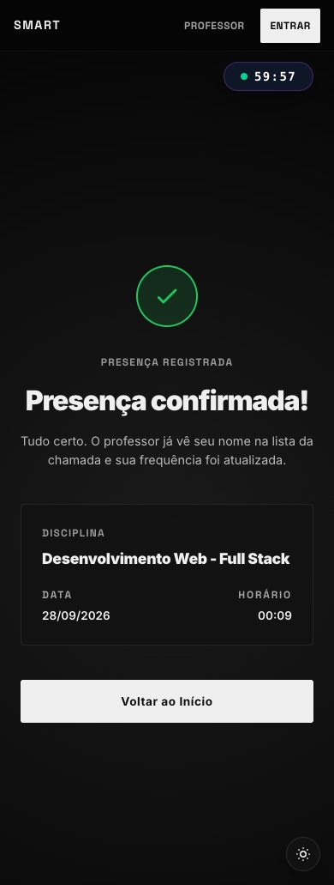

| Mensagem | O que significa | O que fazer |
|---|---|---|
| Presença confirmada! | Tudo certo | Nada |
| Presença já registrada | Você já confirmou nesta aula | Nada |
| Você não está matriculado nesta disciplina | A coordenação ainda não fez sua matrícula | Procure a coordenação |
| Este código de presença expirou ou é inválido | A chamada foi encerrada (o QR vale 2 horas) | Avise o professor |

Sem câmera? Peça ao professor o **link da chamada**: ele copia e envia.

### Painel do aluno

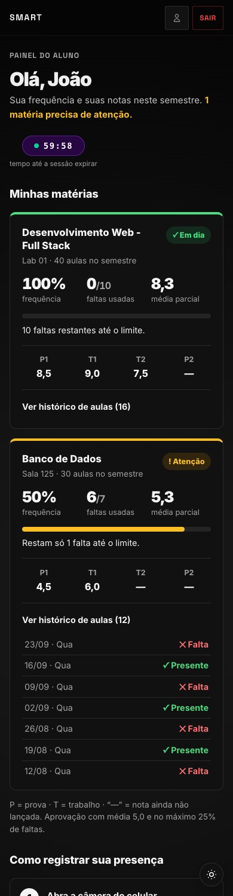 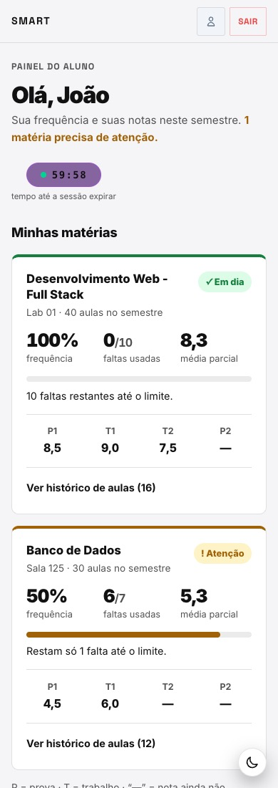

Cada matéria aparece num cartão com:

- **Situação**: *Em dia*, *Atenção*, *Aprovado*, *Reprovado por nota* ou *Reprovado por falta*, sempre com texto e ícone, além da cor.
- **Frequência**: porcentagem de presença nas aulas já realizadas.
- **Faltas usadas**: quantas faltas você tem e quantas pode ter (o limite é 25% das aulas do semestre).
- **Média**: parcial até todas as notas serem lançadas, final depois.
- **Explicação** da situação, por exemplo "Restam só 1 falta até o limite".
- **Notas** P1, T1, T2 e P2. Um traço (—) indica nota ainda não lançada.
- **Ver histórico de aulas**: a data de cada chamada e se você esteve presente ou faltou.

O botão de perfil (ícone de pessoa, no topo) mostra seus dados: nome, e-mail, RA e CPF.

---

## Professor

O painel começa pela tarefa principal, **Iniciar chamada**. Se já houver uma chamada aberta, mostra a matéria e o botão **Abrir a chamada**.

### Fazer a chamada

1. Clique em **Iniciar chamada** e escolha a matéria.

   

2. A tela da chamada mostra o QR Code, a validade (2 horas) e a lista de **Presentes**, que se atualiza sozinha a cada 3 segundos.

   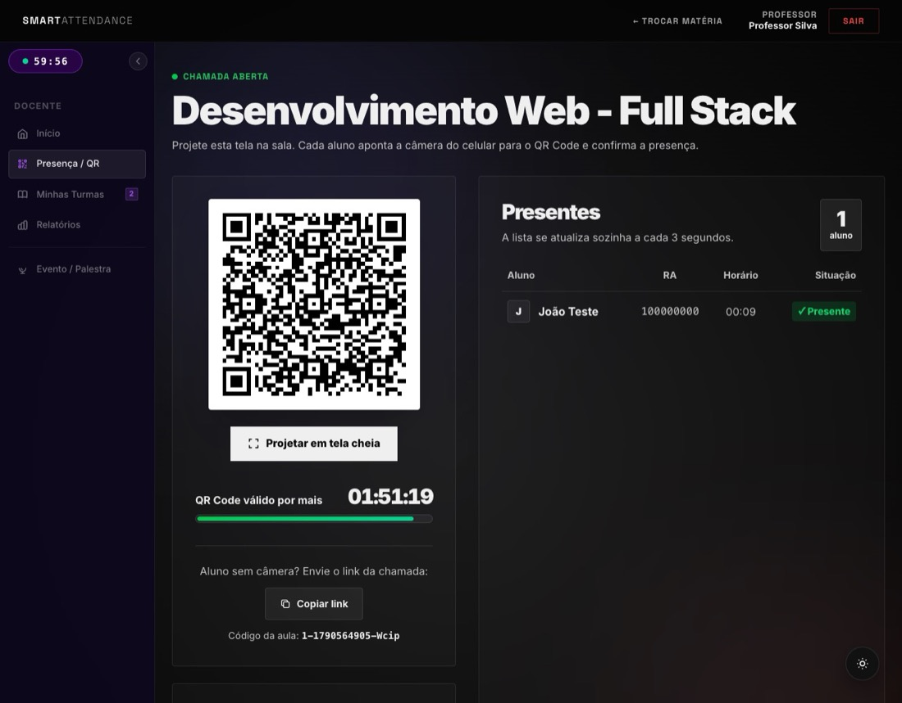

3. Clique em **Projetar em tela cheia** para mostrar o QR Code grande no projetor, com o número de presentes. Aperte **Esc** para sair.

   

4. Aluno sem câmera? Clique em **Copiar link** e envie o link da chamada.

Quando a validade acaba, a tela avisa **Chamada encerrada** e o QR Code para de aceitar presenças.

### Lançar notas

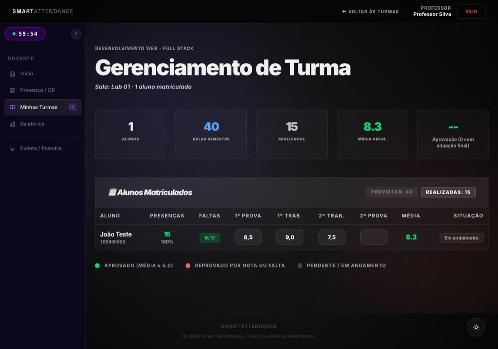

1. No menu lateral, abra **Minhas Turmas** e escolha a matéria.
2. Digite a nota (de 0 a 10) na coluna desejada e aperte **Tab** ou clique fora. A nota é salva sozinha: o campo pisca em verde quando salvou.
3. A **Média** e a **Situação** mudam na hora. O aluno só aparece como *Aprovado* ou *Reprovado por nota* depois que as quatro notas estão lançadas.

Para apagar uma nota, deixe o campo vazio e aperte Tab.

### Relatórios

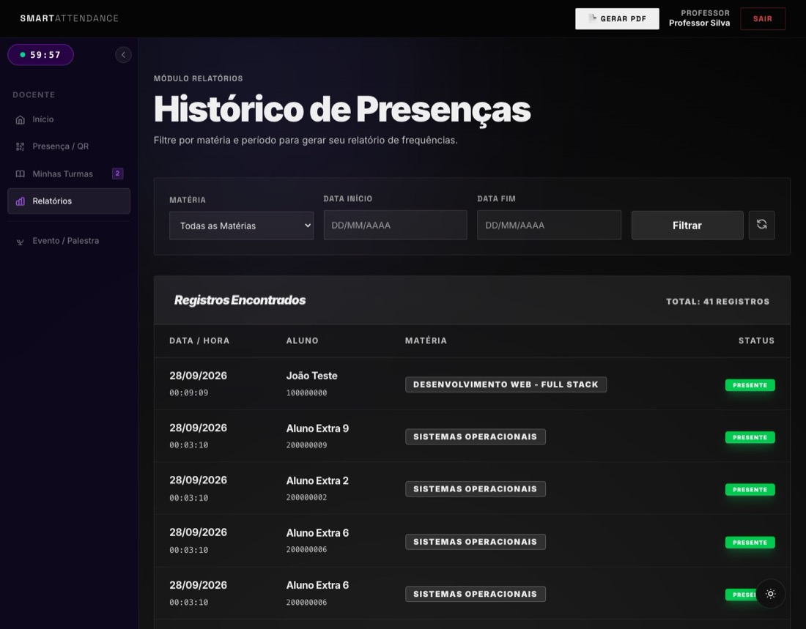

Em **Relatórios**, filtre por matéria e período para ver todas as presenças registradas. O botão **Gerar PDF** abre a versão para impressão.

### Palestras e eventos

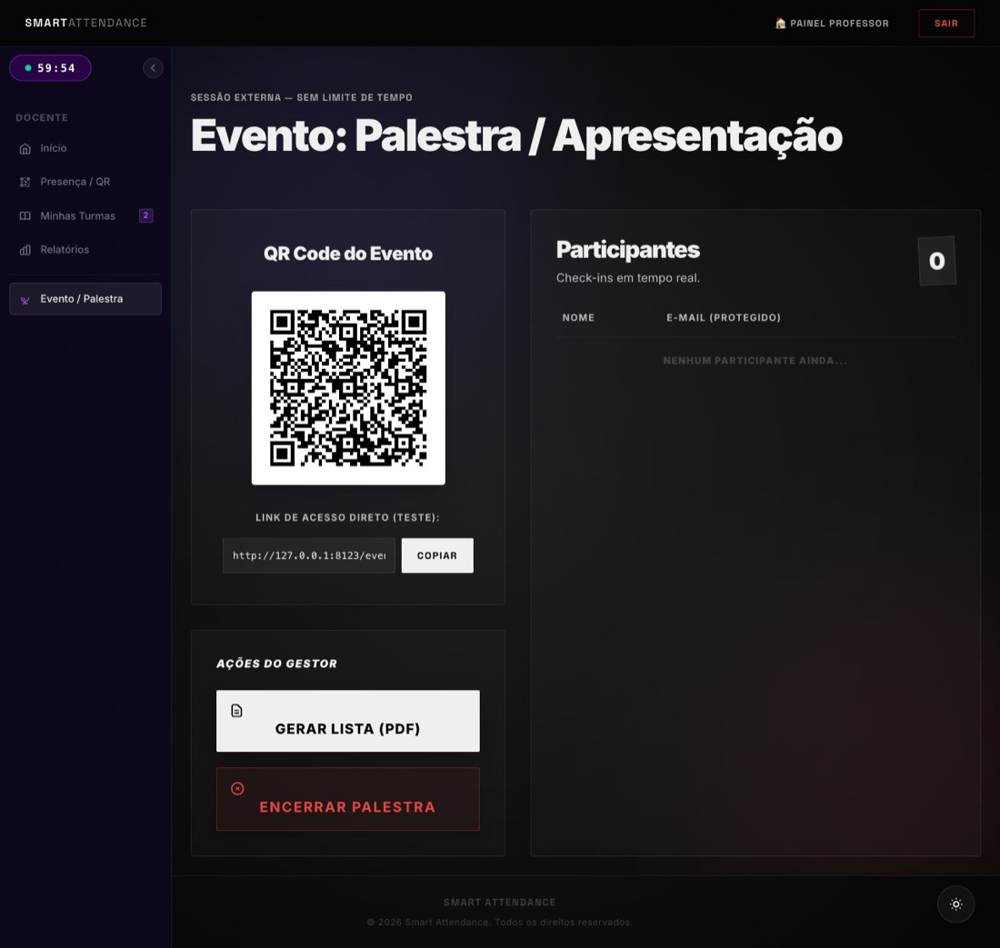

Para eventos com público externo, que não tem login no sistema:

1. No menu, abra **Evento / Palestra**. O sistema gera um QR Code e um link de acesso.
2. O participante escaneia e preenche **nome e e-mail**. A lista de participantes se atualiza a cada 30 segundos.
3. Ao final, clique em **Gerar Lista (PDF)** e depois em **Encerrar Palestra**.

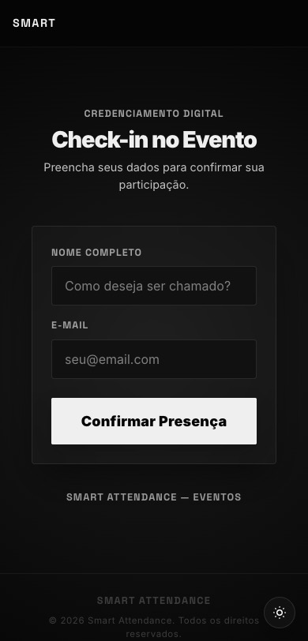

---

## Master (administração)

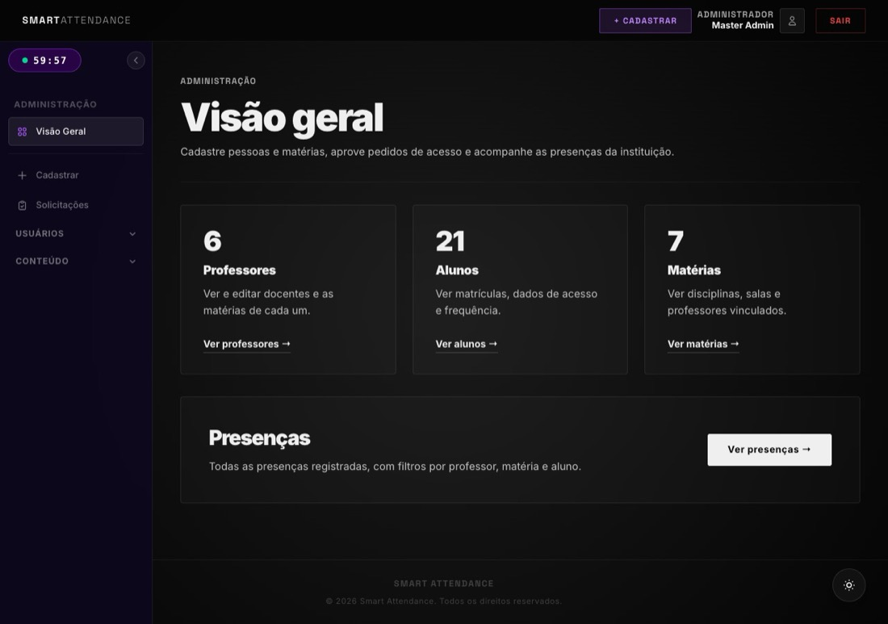

A **Visão geral** mostra o total de professores, alunos e matérias, com atalhos para cada lista. Quando há pedidos de acesso esperando análise, aparece um aviso no topo.

### Cadastrar pessoas e matérias

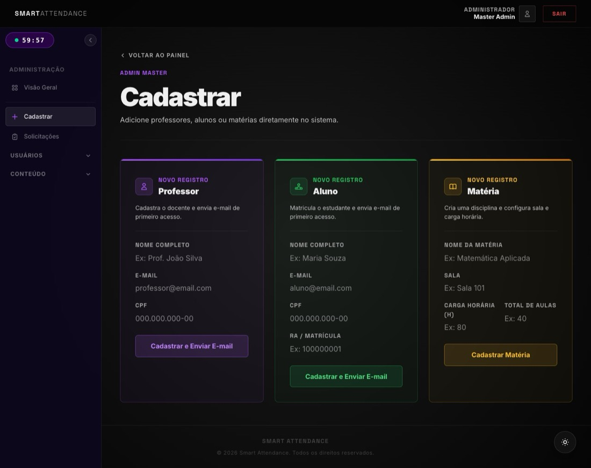

Em **Cadastrar**, preencha o formulário de professor, aluno ou matéria.

- **Professor e aluno**: CPF, RA e e-mail não podem se repetir. Ao cadastrar, o sistema envia o e-mail de primeiro acesso. Se o envio estiver desligado ou falhar, a tela mostra o **token de primeiro acesso** para você entregar à pessoa.
- **Matéria**: nome, sala, carga horária e total de aulas no semestre (usado no limite de faltas). Ao terminar, aparece o atalho **Montar a turma agora**.

### Montar a turma

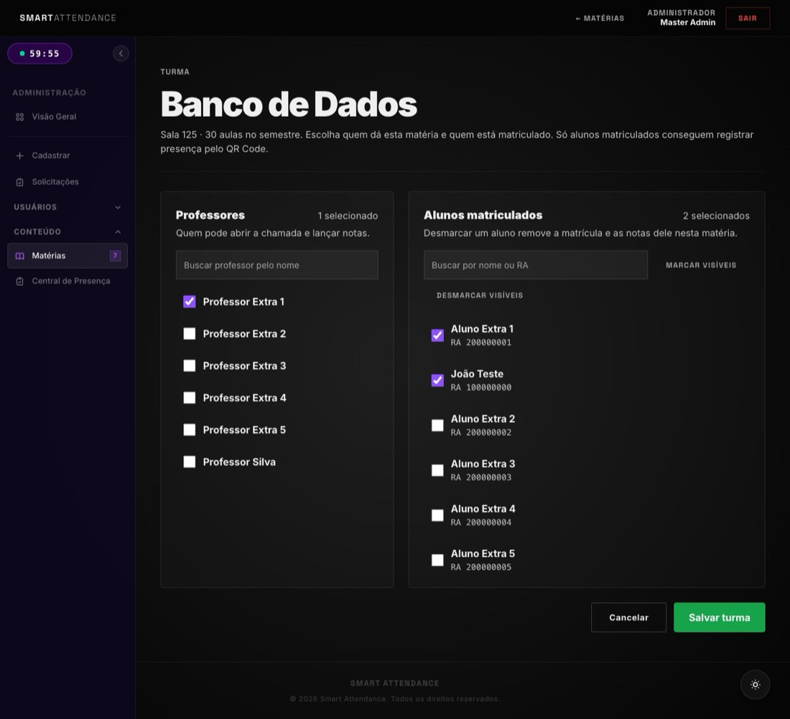

Uma pessoa cadastrada só participa das aulas depois de vinculada à matéria:

1. Menu **Conteúdo → Matérias** → **Gerenciar turma** na matéria desejada.
2. Marque os **professores** que dão a matéria e os **alunos matriculados**. Use a busca por nome ou RA e os botões *Marcar visíveis* / *Desmarcar visíveis*.
3. Clique em **Salvar turma**.

Desmarcar um aluno remove a matrícula e as notas dele nesta matéria. Quem continua matriculado mantém as notas.

### Pedidos de acesso

Em **Solicitações**, os pedidos pendentes aparecem primeiro. **Aprovar** cria a conta e envia o e-mail de primeiro acesso; **Rejeitar** permite informar o motivo. Se já existir uma conta com o mesmo e-mail ou CPF, o pedido é rejeitado automaticamente.

### Central de presenças

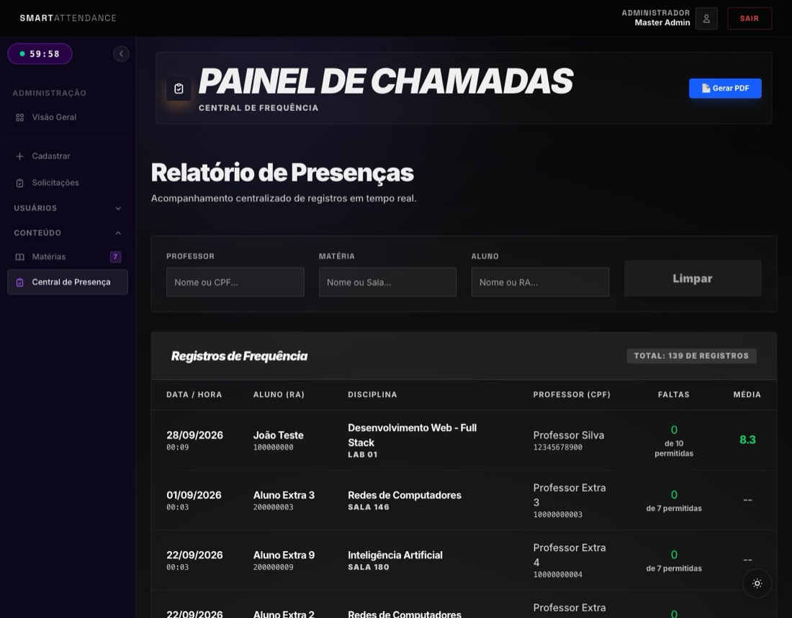

Todos os registros de presença, com filtros por professor (nome ou CPF), matéria e aluno (nome ou RA). A coluna **Faltas** mostra as faltas do aluno naquela matéria em relação ao limite permitido.

---

## Dúvidas frequentes

**O aluno pode registrar presença de casa?**
Não pela página do sistema: o QR Code só aparece na tela do professor. Hoje, uma foto do QR enviada a um colega funcionaria enquanto a chamada estiver aberta; o QR que muda a cada poucos segundos está nos próximos passos.

**Um aluno registrou presença duas vezes?**
Não é possível: o segundo registro na mesma aula mostra "Presença já registrada".

**O professor consegue corrigir uma presença?**
Ainda não pelo sistema. Está nos próximos passos, junto com a justificativa de faltas.

**Apareceu "Sessão expirada".**
A sessão dura 1 hora. Entre de novo: nada é perdido.
