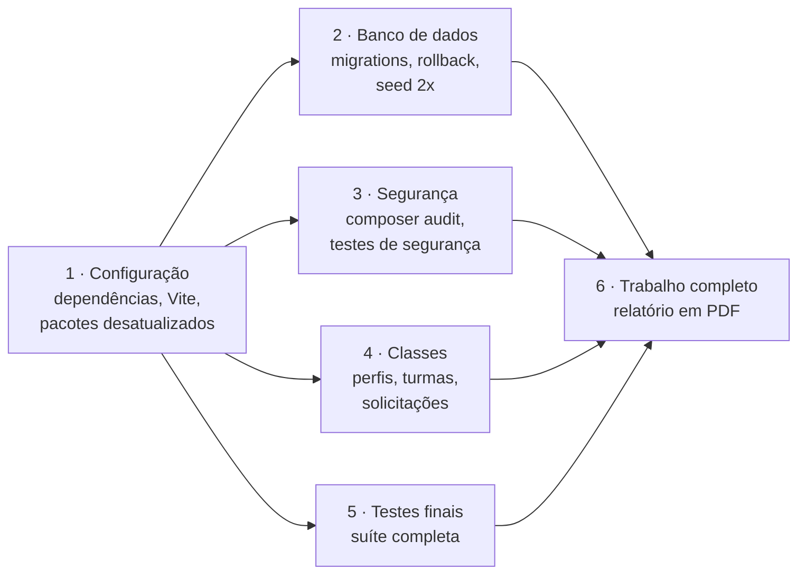

# Testes e integração contínua

## Rodando os testes

```bash
composer test                                  # limpa o cache de configuração e roda tudo
php artisan test                               # suíte completa
php artisan test --filter=MasterTurmaTest      # um arquivo
php artisan test --filter=test_aluno_novo      # um teste pelo nome
```

Os testes usam **SQLite em memória** (definido no [`phpunit.xml`](../phpunit.xml)), então não precisam de PostgreSQL. O e-mail usa o mailer `array`, que guarda as mensagens sem enviar.

Para rodar contra o PostgreSQL, como faz o CI:

```bash
DB_CONNECTION=pgsql DB_DATABASE=smart_attendance_test php artisan test
```

## O que está coberto

São **204 testes** e 558 verificações. As tabelas abaixo contam os métodos de teste de cada arquivo; alguns rodam mais de uma vez com dados diferentes, por isso a soma é um pouco menor que o total.

### Fluxos do sistema

| Arquivo | Testes | Cobre |
|---|---|---|
| `LoginTest` | 19 | Login dos três perfis por RA, e-mail e CPF; credenciais inválidas |
| `MasterCadastroTest` | 22 | Cadastro de aluno, professor e matéria; validações; token quando o e-mail não é enviado |
| `PresencaTest` | 12 | Geração do QR, confirmação, duplicidade, lista de presentes e chamada à noite |
| `EventoTest` | 10 | Check-in de palestra, lista e encerramento |
| `SolicitacaoAcessoTest` | 9 | Pedido público, duplicidade, aprovação, rejeição e falha de SMTP |
| `GerenciarMateriaTest` | 9 | Turmas do professor e lançamento de notas |
| `PrimeiroAcessoCriarSenhaTest` | 8 | Primeiro acesso com token e criação de senha |
| `CriarSenhaTest` | 7 | Regras da senha definitiva |
| `DashboardTest` | 7 | Painéis dos três perfis |
| `MasterTurmaTest` | 7 | Gerenciar turma, notas preservadas e o fluxo cadastro → chamada |
| `QrCodePresencaTest` | 6 | Validade, código inválido e aluno não matriculado |
| `IntegracaoTabelasTest` | 5 | Relacionamentos entre as tabelas |
| `SoftDeleteTest` | 4 | Exclusão lógica |
| `PasswordRecoveryTest` | 3 | Recuperação de senha sem revelar se a conta existe |
| `CronManterBancoTest` | 3 | Rota da tarefa diária protegida pelo segredo |
| `HistoricoAlunoTest` | 2 | Histórico de aulas e faltas iguais na central do Master |

### Segurança

| Arquivo | Testes | Cobre |
|---|---|---|
| `UnauthorizedAccessTest` | 10 | Acesso sem login a áreas protegidas |
| `RoleMiddlewareTest` | 9 | Cada perfil só nas próprias rotas |
| `BlindIndexTest` | 7 | Hash determinístico, normalização e gravação |
| `EncryptionTest` | 6 | Dados pessoais cifrados no banco e decifrados pelo model |
| `IsolamentoPaineisTest` | 6 | Isolamento entre os painéis |
| `SqlInjectionTest` | 5 | Tentativas de injeção em login e buscas |
| `RateLimitTest` | 4 | Bloqueio após várias tentativas |
| `CsrfTest` | 3 | Requisições sem token recebem 419 |
| `XssTest` | 3 | Scripts em campos de texto são escapados |
| `ColumnInjectionTest` | 2 | Só colunas de nota permitidas podem ser alteradas |
| `HoneypotTest` | 2 | Envio de robô no check-in é recusado |
| `SecurityHeadersTest` | 1 | Cabeçalhos HTTP de segurança |

### Regras

| Arquivo | Testes | Cobre |
|---|---|---|
| `Unit/SituacaoAcademicaTest` | 7 | Faltas, limite, frequência, média e cada situação |

## Pipeline do GitHub Actions

O [workflow](../.github/workflows/laravel.yml) roda em todo push e Pull Request para a `main`, e também manualmente. Cada módulo sobe seu próprio PostgreSQL 17, com credenciais fixas de teste: não depende de *secrets*, então roda também em PRs vindos de forks.



| Módulo | O que verifica |
|---|---|
| 1 · Configuração | Instala dependências, compila o Vite e gera os relatórios de pacotes desatualizados e de `npm audit` |
| 2 · Banco de dados | Migrations, `migrate:status`, seed rodado duas vezes (não pode duplicar) e rollback |
| 3 · Segurança | `composer audit`, testes de segurança e `route:list` |
| 4 · Classes | Primeiro acesso, isolamento entre painéis, papéis, cadastros, turmas e solicitações |
| 5 · Testes finais | Suíte completa |
| 6 · Trabalho completo | Relatório em PDF do pipeline, disponível em **Actions → execução → Artifacts** por 90 dias. Não roda em Pull Requests |

Os módulos 2 a 5 rodam em paralelo. Um módulo com falha não interrompe os outros, para o relatório mostrar todos os problemas de uma vez.
